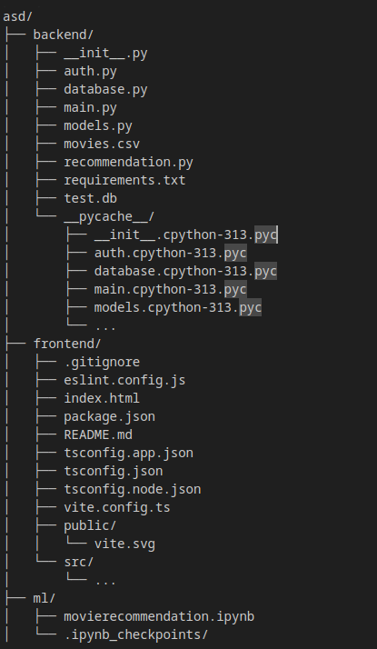
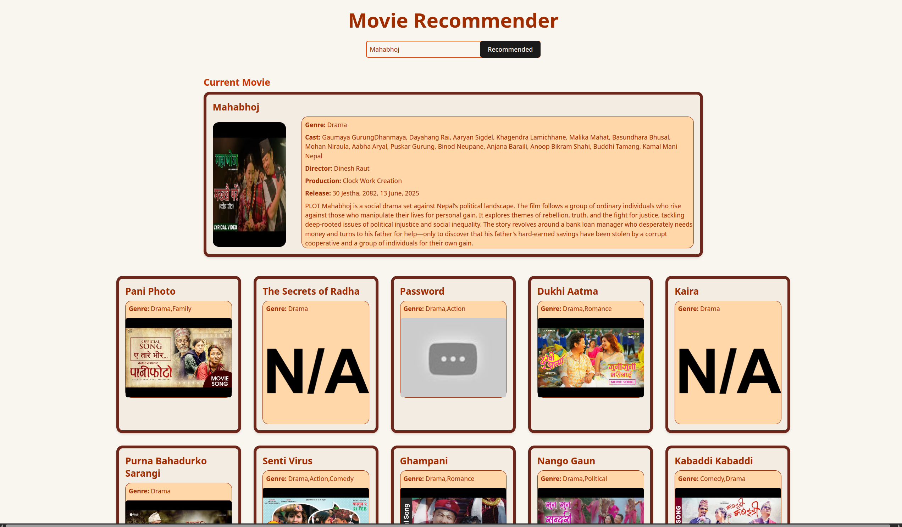

# Nepali Movie Recommendation System

A **content-based movie recommendation system** for Nepali movies built using **FastAPI**, **React/TypeScript**, and **scikit-learn**.  
The system recommends movies based on **genre, cast, director, production house, and plot**.

---

## 🗂 Project Structure

Create a virtual environment and activate it:

python -m venv venv
source venv/bin/activate.fish   #In linux

Install dependencies:

pip install -r requirements.txt

Run FastAPI:

uvicorn main:app --reload

Frontend:

Navigate to frontend/ folder:

cd frontend

Install npm dependencies:

npm install

Run development server:

npm run dev

Features:

Search Movies – Users can search for Nepali movies by typing the title in the search bar.

Autocomplete Suggestions – Shows matching movie titles as you type for faster selection.

Top 10 Recommendations – Provides top 10 similar movies based on genre, cast, director, production house, and plot.

Detailed Movie Info – Each recommended movie displays:

Title

Genre

Cast

Director

Production House

Release Date

Plot Summary

Image and Video URL (if available)

User Authentication – Secure access using JWT-based login and registration.

Default Handling – Automatically handles missing values like images or production house info.

Responsive Frontend – Mobile-friendly React/TypeScript interface with TailwindCSS.

Data-Driven Recommendations – Uses content-based filtering with cosine similarity for relevant suggestions.
